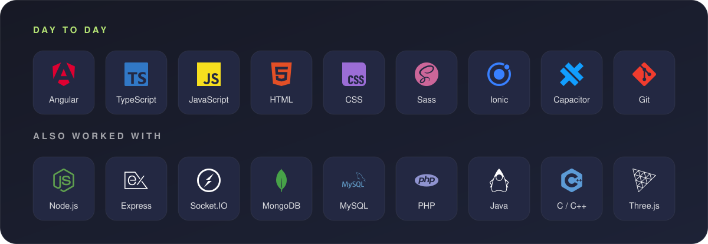
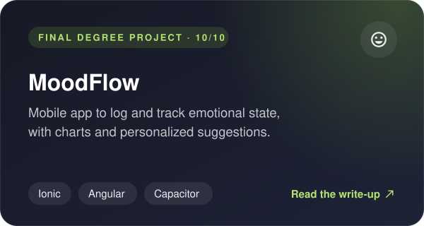
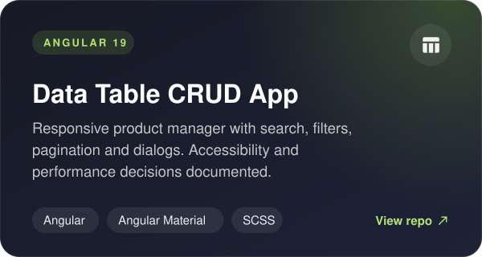
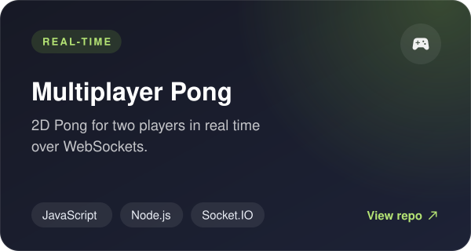
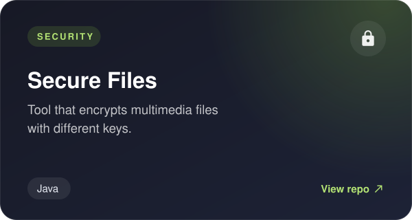

  

  
  
  
  

## About me

- I build web applications with **Angular** and **TypeScript** at **Volkswagen Digital:Hub**. Before that I was an Angular developer intern at **NTT DATA**.
- I studied **Multimedia Engineering** at the University of Alicante. My final degree project, **MoodFlow**, was graded **10/10**.
- I enjoy building mobile apps with **Ionic** and **Capacitor**.
- I worked a lot on cybersecurity during my degree, so I care about interfaces that are secure, accessible and pleasant to use.

## Tech stack

## Featured projects

  
  

  
  

## Get in touch

The quickest way to reach me is [LinkedIn](https://www.linkedin.com/in/%C3%A1lvaro-s%C3%A1nchez-pinedo-25a9b7291/) or [email](mailto:alvarosnchzpnd@gmail.com). You can also see more of my work in my [portfolio](https://asp161.github.io/portfolio/).
